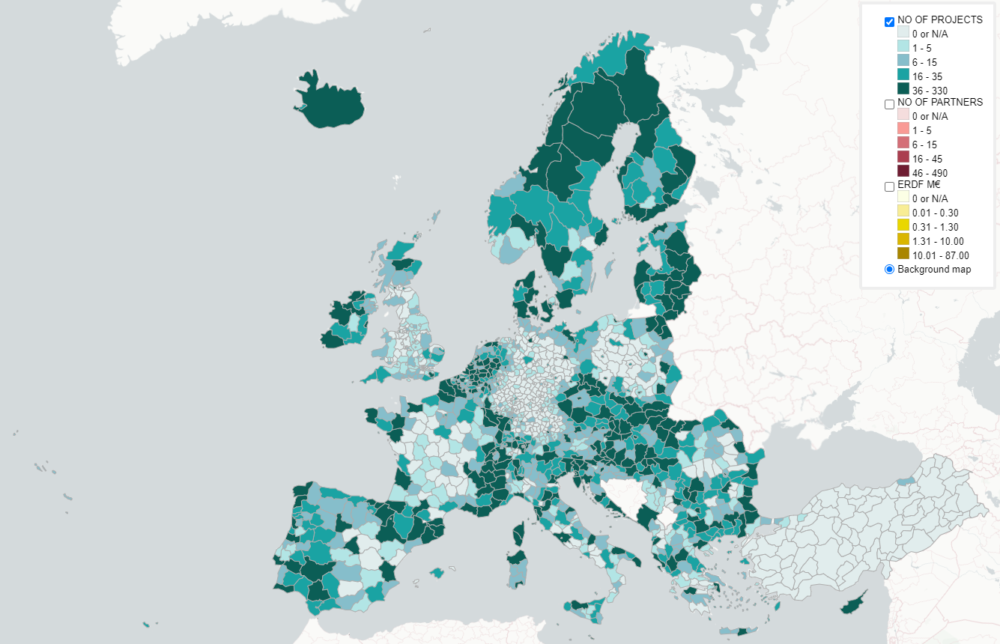

# Interactive map on EU Cohesion Policy data

Welcome to explore an online map displaying project, partner and financing information on the Interreg, IPA CBC and ENI CBC financing instruments of the European Union Cohesion Policy.
The used data is from the 2014-2020 period.

  

## Data on the map

The geographical unit of the map is the NUTS3 statistical unit.  

There are three layers on the map displaying the following data by colour and in numbers:
- Projects: the number of individual projects per NUTS3
- Project partners: the number of project partners per NUTS3 (a single organisation is counted as many times as it has participated in separate projects)
- ERDF financing: the amount of financing from the European Regional Development Fund (ERDF) received by the partners in the given NUTS3 region (in millions of euros). Note that for each region also the full total of project budgets is available in the info box when holding the mouse on top of the region.

## Instructions for use

- Select the layer of your interest in the top right menu. Notice that only the topmost selected layer is visible. 
- Zoom in to see the numeric values of the regions on the selected layer/topic.  
- Regardless of the selected layer you can move your mouse on the map to view full data of an individual region.  
- The map works best on desktop.

## Data sources

The Interreg data is from the [keep.eu database](https://keep.eu). Data download date 29.5.2023.
Statistical NUTS regions are from [Eurostat](https://ec.europa.eu/eurostat/web/gisco/geodata/reference-data/administrative-units-statistical-units/nuts).  
Basemap is from [CartoCD] via QGIS QMS plugin.

## Used software

The map is created with QGIS and its qgis2web plugin on OpenLayers. Basemap is loaded using the QuickMapServices plugin.

## Licence

The map is licenced with the [GNU General Public License version 2.0](https://github.com/GispoCoding/eu-interreg-map/blob/main/LICENSE). 

## And finally... The Map

Interactive map: [https://gispocoding.github.io/eu-interreg-map/map.html](https://gispocoding.github.io/eu-interreg-map/map.html)
